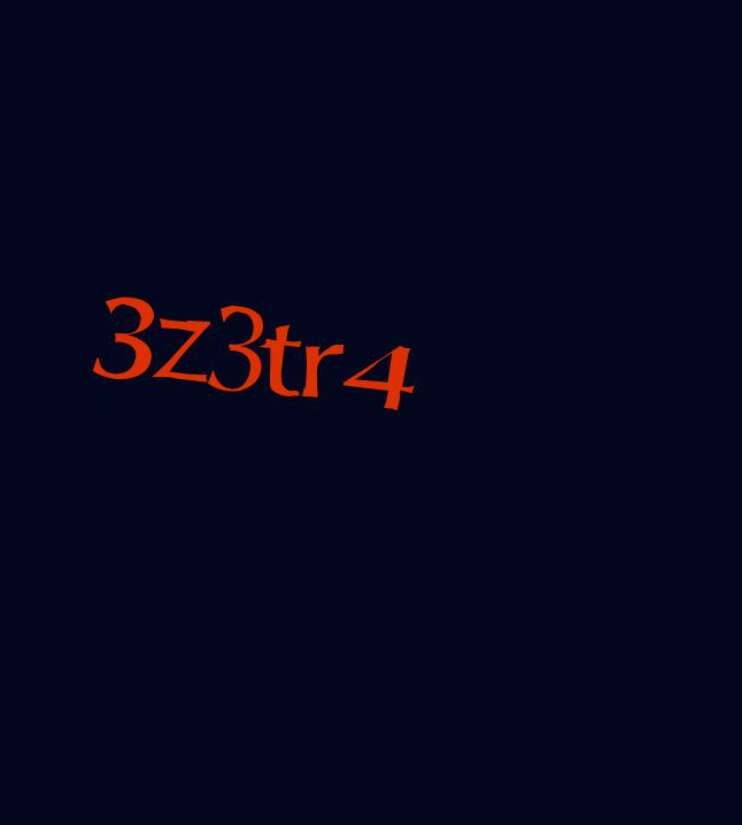

# The CAPTCHAs

Captchas 是生成验证码的集合，必须在链上解决才能铸币。 它们可作为链上验证码的概念证明，这会使机器人更难参与 NFT 投放。

验证码 NFT - 常见问题 (FAQ)
▶ 什么是验证码？
验证码是一个 NFT（不可替代令牌）集合。 存储在区块链上的数字艺术品集合。
▶ 存在多少个 CAPTCHA 代币？
总共有 3,880 个验证码 NFT。 目前，1,611 位所有者的钱包中至少有一个 The CAPTCHA NTF。
▶ 最近卖出了多少个验证码？
过去 30 天内售出 0 个 CAPTCHA NFT。

