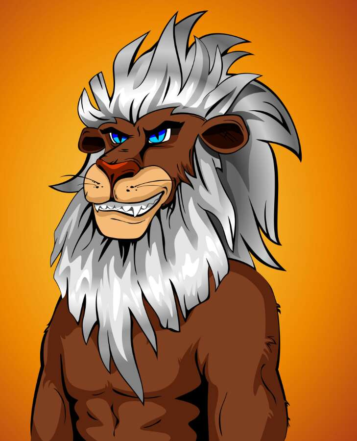

# The Cheeky Lion Club

Cheeky Lion Club 是 The Cheeky Cougar Club 的官方育种合作伙伴。 它们是 8,000 个 Cheeky Lion NFT 的私人收藏，以 ERC-721 代币的形式存储在以太坊区块链上。

The Cheeky Lion Club NFT - 常见问题（FAQ）
▶ 什么是厚脸皮狮子会？
Cheeky Lion Club 是一个 NFT（不可替代代币）系列。 存储在区块链上的数字艺术品集合。
▶ 有多少 The Cheeky Lion Club 代币？
总共有 8,009 个 The Cheeky Lion Club NFT。 目前，5,113 位车主的钱包中至少有一本 The Cheeky Lion Club NTF。
▶ The Cheeky Lion Club 最贵的促销活动是什么？
最昂贵的 The Cheeky Lion Club NFT 是 Cheeky Lion #7405。 它于 2022-08-17（14 天前）以 7 美元的价格售出。
▶ The Cheeky Lion Club 最近卖出了多少？
过去 30 天内售出了 2 个 The Cheeky Lion Club NFT。

