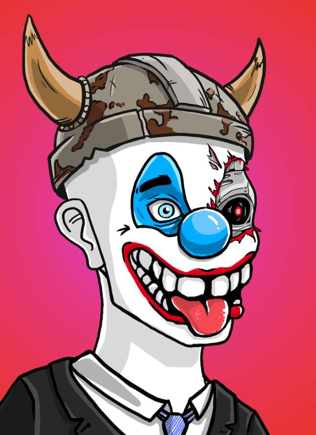

# ClownzGang

你有没有发现自己认为这个世界上的一切都太严肃了？无论贫富，我们都有问题要面对。我们一直把它们记在脑海里，以至于我们中的一些人甚至对它们做恶梦。

但是，如果我们暂时放下它们，然后露出灿烂的笑容，那会怎样。没有人可以证明什么是对的，什么是错的，所以我们为什么要关心。没有人能证明你的全新法拉利超速是错误的。同样，没有人能证明殴打你的脾气暴躁的老板是一个糟糕的主意。这样想你可能会发疯。还是你会？那谁来证明呢？

有一帮小丑把自己困在这种思维方式中。他们没有问题，没有悔恨。没有什么是他们做不到的，也没有什么是他们必须做的。他们的生活从不严肃。为什么会这样？正如一位著名的小丑曾经说过的那样，“为什么这么严肃”？他们在混乱中过着最好的生活。上帝知道那些试图劝阻他们的人会发生什么。

我们不能说这对他们是好是坏。我们只能说，他们渴望进入我们的世界。让他们进来吧！

