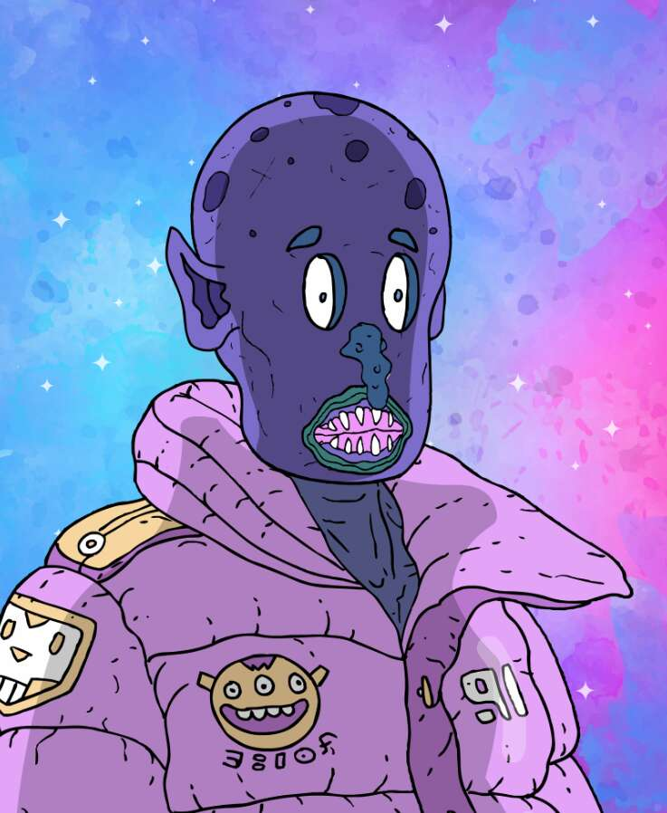

# The Cosmo Gang

COSMO 帮是什么？

Cosmo Gang 是一个以漫画为灵感的外星艺术项目，旨在成为 P2E 和元宇宙体验的前沿。

Cosmogs 都来自不同的星球，这些星球（大部分时间）和平地生活在银河系中。
当他们收到来自远离家园的未知地点的消息时，他们正在他们的土地上闲逛。

他们总是愿意找点乐子，跳进他们的太空车跟随信号。
他们不打算在一个充满怪人人类的星球上结束。

Cosmo Gang NFT 是随机生成的，在以太坊区块链上以 ERC-721 代币的形式存在。 所有艺术品都存储在 IPFS 上，每个持有者都被赋予其 NFT 的完全所有权和商业使用权。

