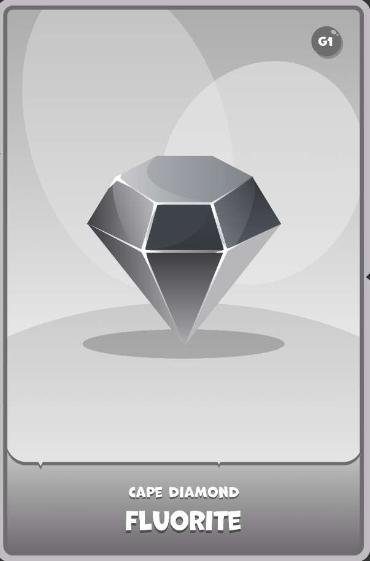

# The Crypto Prophecies - Summoning Stones

Crypto Prophecies 是一款去中心化的点对点价格预测游戏，拥有可爱的可收藏角色，称为 Crypto Prophets，他们可以使用魔法物品在战斗中获得胜过对手的优势。召唤石是召唤 Crypto Prophets 和魔法物品进入 加密预言的世界。 在召唤传送门召唤加密先知或魔法物品是一种机会游戏。召唤石的每个稀有等级都有不同的召唤概率。 例如，稀有的海蓝宝石先知宝珠有 85% 的几率找到稀有的加密先知，但对于一些幸运的玩家，它也有 4% 的几率召唤史诗般的加密先知和 0.05% 的几率找到传奇。当你放置 您在召唤传送门上的召唤石，由 ChainLink 提供支持的随机数生成器将考虑召唤石的稀有度并根据百分比滚动。 作为铸币交易的一部分，这一切都可以在链上进行验证。

