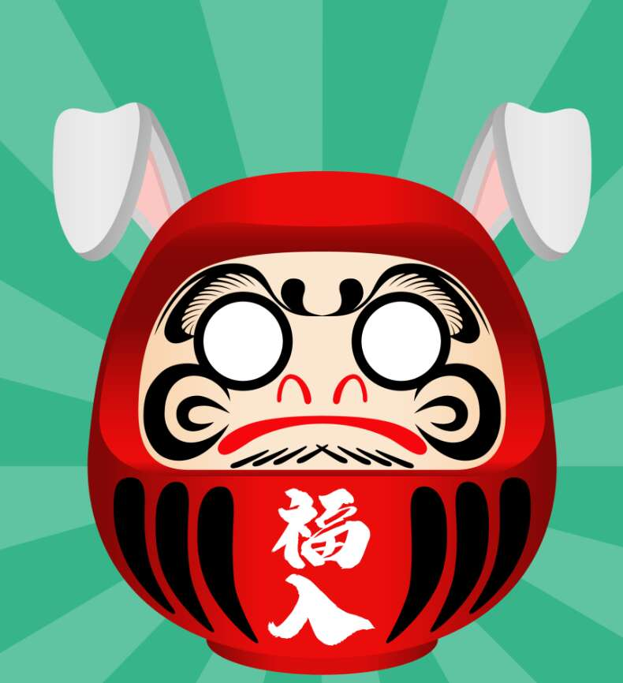

# The Daruma NFT

Daruma NFT 是一组程序生成的艺术品，从超过 100k 的总选项中限制为 10,000 件，包括随机服装、化妆和祝福。 希望每个人都可以通过拥有自己的达摩找到和平。什么是达摩？
达磨だるま达摩是日本的吉祥物。 它带来好运，也可以用来许愿。Daruma NFT 是一组程序生成的艺术品，从超过 100k 的总选项中限制为 10,000 件，包括随机服装、化妆和祝福。 希望每个人都可以通过拥有自己的达摩找到和平。

