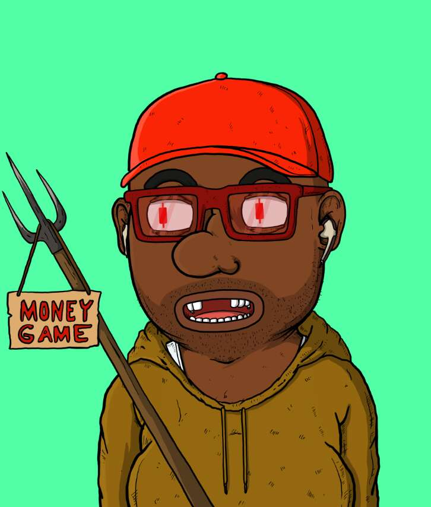

# DegenTrader

5,000 名 DEGEN 交易者在区块链上过着自己的生活！Degen 交易者是在 Polygon 上铸造的 ERC721，手绘 FegEx 生态系统中 $DEGEN SmartDefi 令牌的官方艺术收藏。 我们的愿景和使命是通过社区、创造力、讽刺和有趣的艺术为世界带来更多乐趣！加入并获得您的 Degen

DegenTrader NFT - 常见问题（FAQ）
▶ 什么是 DegenTrader？
DegenTrader 是一个 NFT（不可替代代币）集合。 存储在区块链上的数字艺术品集合。
▶ 有多少 DegenTrader 代币？
总共有 5,000 个 DegenTrader NFT。 目前 76 位所有者的钱包中至少有一个 DegenTrader NTF。
▶ 最近卖出了多少 DegenTrader？
过去 30 天内售出 0 个 DegenTrader NFT。

