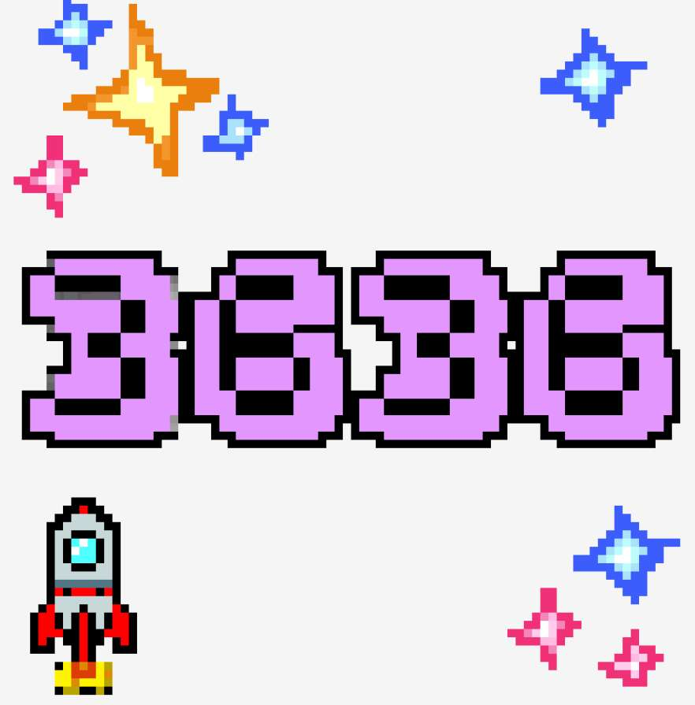

# The Digihats

Digihats 是 8888、88x88 像素的计算机生成数字的集合，每个数字都有自己的独特性； 没有两个是一样的。 每个 Digihat 都有数字、背景、物品、帽子和特殊物品的颜色组合。 除了随机生成的 Digihats 之外，还有一些特殊编号的 Digihats 是手绘的，每个人都讲述着自己的故事。 我们也是第一个跨链NFT项目； BSC ETH！NFT stats 为您提供有关 NFT 空间的最新信息。 如果您想找到最好的 NFT 购买、即将推出的 NFT 项目、最昂贵的 NFT 是什么——我们将为您提供您需要的数据、图表、见解和新闻。

