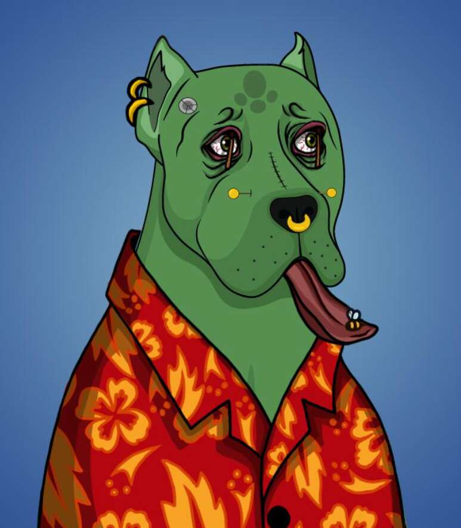

# The Dogo

Dogo NFT - 常见问题（FAQ）
▶ 什么是狗狗？
Dogo 是一个 NFT（不可替代令牌）集合。 存储在区块链上的数字艺术品集合。
▶ 有多少个 Dogo 代币？
总共有 380 个 Dogo NFT。 目前，254 位车主的钱包中至少有一个 The Dogo NTF。
▶ The Dogo 最近卖出了多少？
过去 30 天内共售出 0 个 The Dogo NFT。

以太坊区块链上的 380 个 DOGO 集合。每个 DOGO 都是由经验丰富的设计师团队从 200 多个手绘特征中随机生成的，并受到著名的 instagram 加密爱好者 - Miki Fergy 的启发。

