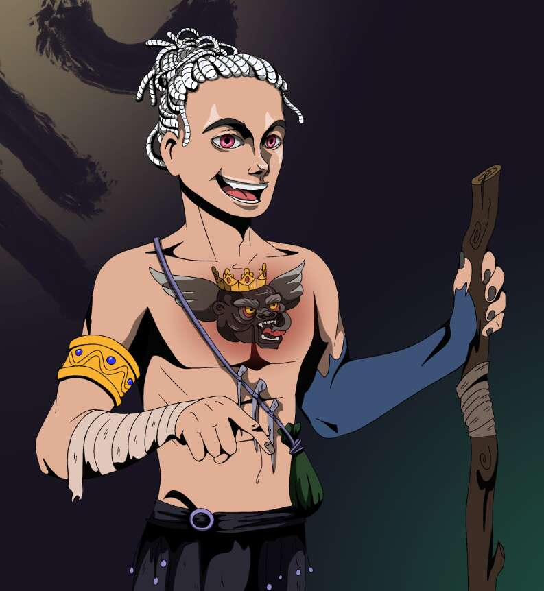

# The Eternal Mages

永恒法师是第一个以冒险任务和战斗系列为中心的 3,333 名英雄的可升级集合。 每个 PFP 都是您进入游戏的门票，这会增加您的英雄的稀有度，并可以访问可定制的 NFT 软件。 欢迎来到永恒之路！

私人建筑师-设计师
巴萨蒂娜·叶卡捷琳娜

教育：
2012-2016 - 圣彼得堡建筑与土木工程学院，专业“建筑师”。
2016-2022 - 列宁格勒国立大学。基洛夫，专业“景观设计师”
高级培训课程：AMS3，Ilya Izotov 的 3d 图形学院，设计学院“ART&Shock”

从历史上看，在公寓装修期间，我的第一批客户碰巧不能在场，所以我开始提供这方面的全方位服务。我的工作不仅是绘制图纸，还创作精美的室内照片。我是负责修复和实施设计项目的所有困难的人。您无需花时间选择团队、就估算达成一致、购买材料。我很高兴为您提供设计项目的全力支持。从通过代理接受公寓到安装对讲机和组织搬家的一切

