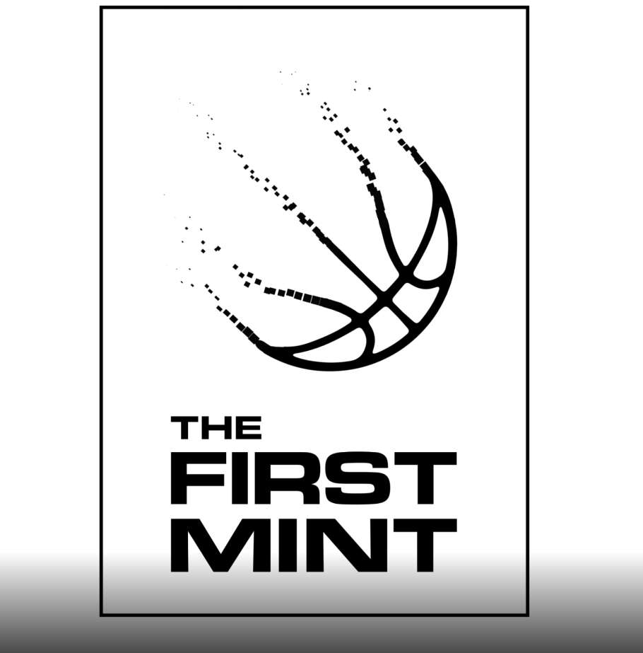

# thefirstmint

The First Mint DAY ONE 代表加入 The First Mint 社区。 您将需要这个 NFT 来访问我们的 Discord 并初步了解我们正在开展的所有工作。

The First Mint DAY ONE NFT - 常见问题（FAQ）
▶ 什么是 The First Mint DAY ONE？
First Mint DAY ONE 是一个 NFT（不可替代代币）系列。 存储在区块链上的数字艺术品集合。
▶ 有多少 The First Mint DAY ONE 代币？
总共有 550 个 The First Mint DAY ONE NFT。 目前，454 位所有者的钱包中至少有一个 The First Mint DAY ONE NTF。
▶ The First Mint DAY ONE 销售中最贵的是什么？
最昂贵的 The First Mint DAY ONE NFT 是 The First Mint DAY ONE。 它于 2022-08-18（13 天前）以 197 美元的价格售出。
▶ The First Mint DAY ONE 最近卖出了多少？
过去 30 天内售出了 6 个 The First Mint DAY ONE NFT。

