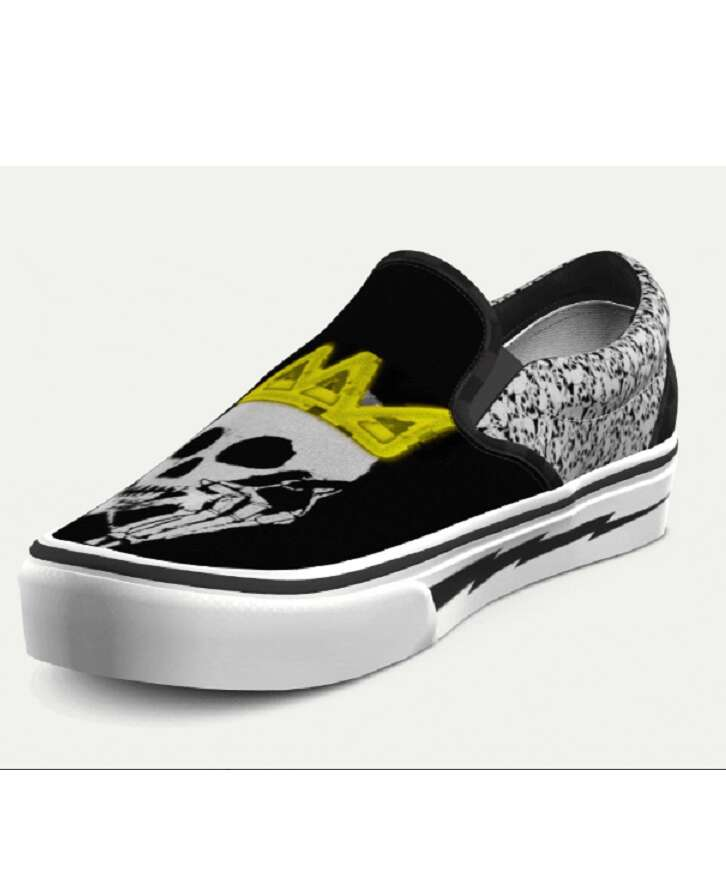

# THE FOUNDRY

Manic 和 Frens 的服装设计和策划。 可索赔的连锁服装，可在世界任何地方发货。Manic 和 Frens 的服装设计和策划。 可索赔的连锁服装，可在世界任何地方发货。 在剩余的薄荷糖在铸造厂燃烧之前，每一滴都有 72 小时的时间来收集。声明网站并在不和谐中发布燃烧信息。

THE FOUNDRY NFT - 常见问题（FAQ）
▶ 什么是铸造厂？
THE FOUNDRY 是一个 NFT（不可替代代币）集合。 存储在区块链上的数字艺术品集合。
▶ 有多少个 THE FOUNDRY 代币？
总共有 2 个 THE FOUNDRY NFT。 目前 9 位所有者的钱包中至少有一个 THE FOUNDRY NTF。
▶ THE FOUNDRY 最近卖了多少？
过去 30 天内售出 0 个 THE FOUNDRY NFT。

