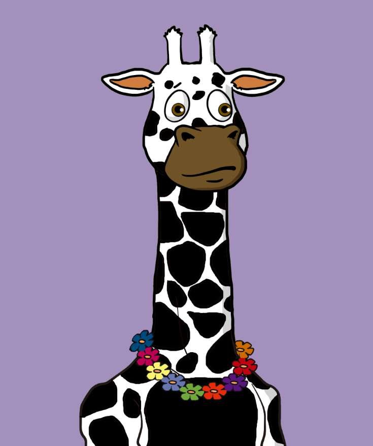

# TheGiraffes

长颈鹿 NFT
#1。 每个假期，人们都会聚集在马戏团。
在一个玻璃笼子里，他们互相梳理毛发，但即使这样也开始变得令人沮丧。 他们向外看，看到人们咯咯地笑着玩得开心，但有什么好笑的呢？
然后有一天，一张海报飞到了一只打着哈欠的长颈鹿面前。 海报中描绘了长颈鹿的天堂。
（最完整的生态系统：新建的半月国家公园）

#2。 有这样的地方吗？
现在长颈鹿甚至不再关心训练师的热情训练了。
当他们跳过燃烧的戒指并演奏乐器时，海报中的画面浮现在他们的脑海中。

