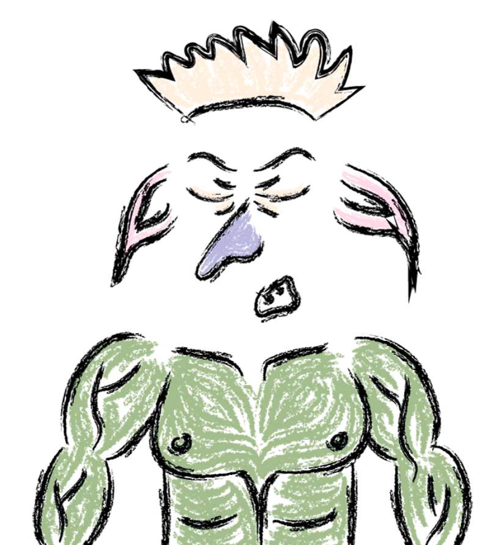

# The Goblin Culture

妖精文化 NFT - 常见问题（FAQ）
▶ 什么是妖精文化？
地精文化是一个 NFT（非同质代币）集合。存储在区块链上的数字艺术品集合。
▶ 妖精文化代币有多少？
总共有 6,969 个妖精文化 NFT。目前，3,000 名所有者的钱包中至少有一本 The Goblin Culture NTF。
▶ The Goblin Culture 最贵的拍卖会是什么？
售出的最昂贵的 The Goblin Culture NFT 是 The Goblin Culture #4342。它于 2022-06-06（3 个月前）以 18.1 美元的价格售出。
▶ 哥布林文化最近卖出了多少？
过去 30 天内售出了 40 个 The Goblin Culture NFT。
▶ 哥布林文化需要多少钱？
过去 30 天，最便宜的 The Goblin Culture NFT 销售额低于 4 美元，最高销售额超过 13 美元。过去 30 天，The Goblin Culture NFT 的中位价格为 9 美元。
▶ 什么是流行的妖精文化替代品？
许多拥有 The Goblin Culture NFT 的用户还拥有 AiBOTS、TheClaymores、Tales of Akemi 和 Gunked_Goblintown.wtf。

