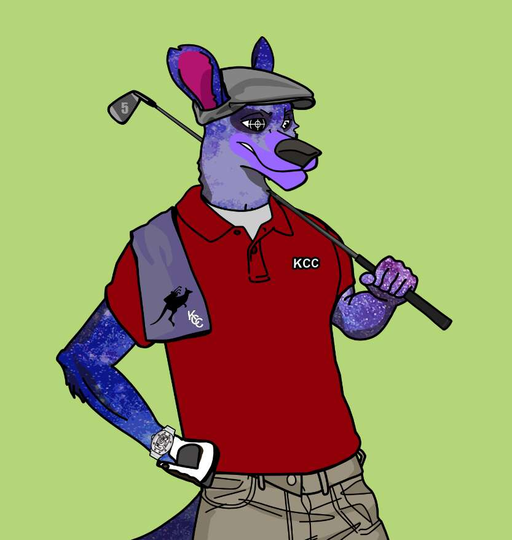

# The Kangaroo Country Club

袋鼠乡村俱乐部由 7,777 个手绘袋鼠 NFT 组成。 社区不仅关注 NFT，还关注 IRL 活动（高尔夫锦标赛/郊游）、赠品和品牌合作伙伴关系等好处。 拥有“Roo”可以让您进入俱乐部。 1 Roo = 1 次参加社区活动！ 拥有由袋鼠乡村俱乐部 (KCC) 制作的 NFT 将授予您全部的个人和商业权利以及全部转让的所有权和责任。欢迎袋鼠乡村俱乐部！2 月铸造“ROO”。 17TH（或在二级市场购买）授予您 KANGAROO 乡村俱乐部的独家会员资格。 袋鼠乡村俱乐部的目标是通过社区钱包为我们的数字会员提供以下服务

