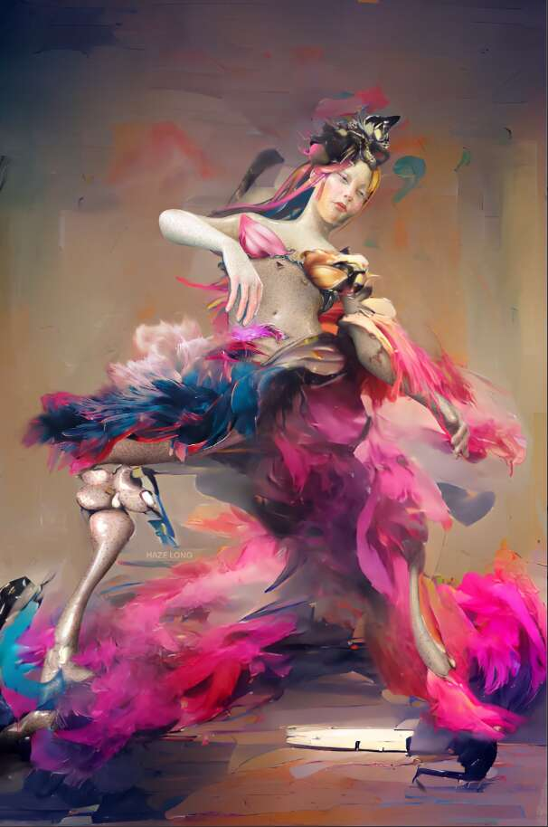

# The Last Dream by Haze Long

The Last Dream 是一个正在进行的 NFT 混合媒体艺术作品集。 我的作品是一种生活的陈述，无论是虚拟的还是现实的，都以艺术的形式去中心化。 您可以成为我通过将 AI 技术与 2D 和 3D 程序视觉相结合而创作的独特艺术品的所有者。 每次推出艺术品时，都会有 10/10 个 NFT 用于铸造和销售。 1/1 NFT 将在另一个市场上提供。成为社区的一部分，该社区正在共同努力，在即将到来的元节中创造一个空间。这个由女性领导的项目正在寻求创建一个紧密结合的社区，最终目标是 资助并享受一个专为视觉、音乐和表演艺术展览而设计的虚拟空间。最后的梦想是一个支持专注于儿童虐待预防、应对和心理治疗的慈善机构的项目。 我是虐待儿童的受害者超过 20 年......

