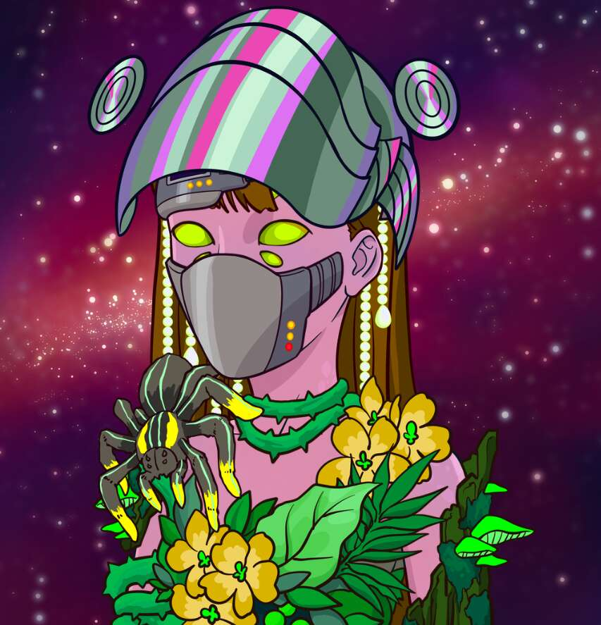

# LegionOfWitches

Legion of Witches 是 10,000 个受流行文化、神秘巫术、动漫和魔法游戏影响的独特审美手绘生成角色。 法术、魔药和仪式是多维军团元宇宙存在空间中的超自然领域。

LegionOfWitches NFT - 常见问题（FAQ）
▶ 什么是 LegionOfWitches？
LegionOfWitches 是一个 NFT（不可替代令牌）集合。 存储在区块链上的数字艺术品集合。
▶ 存在多少 LegionOfWitches 代币？
总共有 381 个 LegionOfWitches NFT。 目前，164 位所有者的钱包中至少有一个 LegionOfWitches NTF。
▶ 最近售出了多少 LegionOfWitches？
过去 30 天内售出 0 个 LegionOfWitches NFT。

