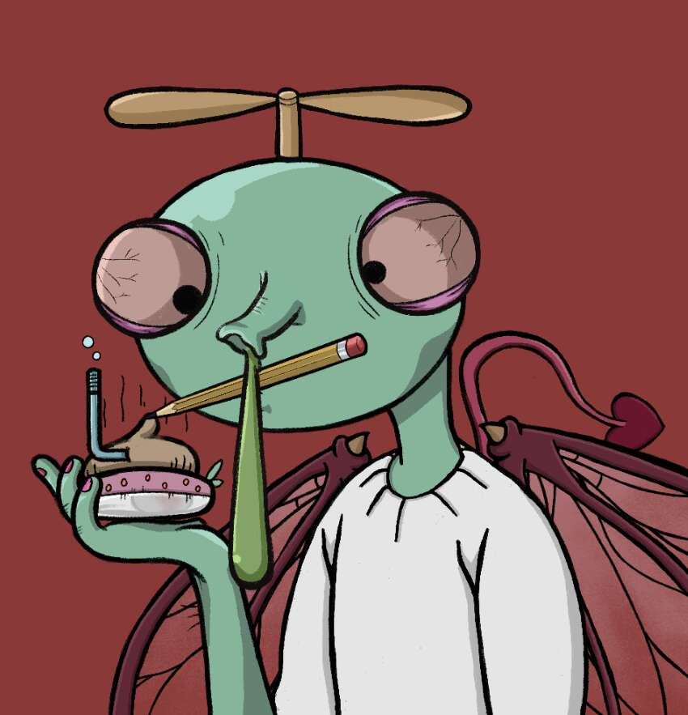

# TheLordOfFlies

苍蝇王原本的“巴尔泽布”形象被颠覆了，但它是一只可爱的苍蝇，像人类一样拥有自己的个性。 这代表了我们对元宇宙未来的理想愿景

TheLordOfFlies NFT - 常见问题（FAQ）
▶ 什么是 TheLordOfFlies？
TheLordOfFlies 是一个 NFT（不可替代令牌）集合。存储在区块链上的数字艺术品集合。
▶ 存在多少 TheLordOfFlies 代币？
总共有 6,000 个 TheLordOfFlies NFT。目前，2,074 位所有者的钱包中至少有一个 TheLordOfFlies NTF。
▶ TheLordOfFlies 最昂贵的销售是什么？
最昂贵的 TheLordOfFlies NFT 是 The Lord of flies #311。它于 2022 年 6 月 26 日（2 个月前）以 15.1 美元的价格售出。
▶ 最近卖出了多少 TheLordOfFlies？
过去 30 天内售出了 90 个 TheLordOfFlies NFT。
▶ TheLordOfFlies 的费用是多少？
在过去 30 天里，TheLordOfFlies NFT 最便宜的销售额低于 1 美元，最高销售额超过 8 美元。 TheLordOfFlies NFT 的中位价格在过去 30 天内为 4 美元。
▶ 什么是流行的 TheLordOfFlies 替代品？
许多拥有 TheLordOfFlies NFT 的用户还拥有 I'm Not Okay NFT、Dick Ape Yacht Club、I'm Nothing 和 GoblinApes。

