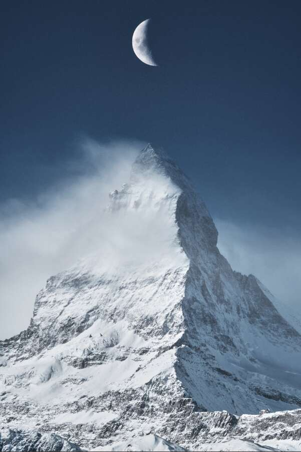

# The Matterhorn Edition: Rise

这张合成图展示了雄伟而美丽的马特宏峰，顶部有美丽的月亮。 这张照片是我第一次访问瑞士时在戈尔内格拉特拍摄的。

The Matterhorn Edition：Rise NFT - 常见问题（FAQ）
▶ 什么是马特宏峰版：崛起？
The Matterhorn Edition: Rise 是一个 NFT（不可替代代币）系列。 存储在区块链上的数字艺术品集合。
▶ 有多少 The Matterhorn Edition: Rise 代币存在？
总共有 1 个 The Matterhorn Edition：Rise NFT。 目前 8 位车主的钱包中至少有一本 The Matterhorn Edition: Rise NTF。
▶ The Matterhorn Edition: Rise 最近卖出了多少？
过去 30 天内售出了 0 个 The Matterhorn Edition：Rise NFT。

