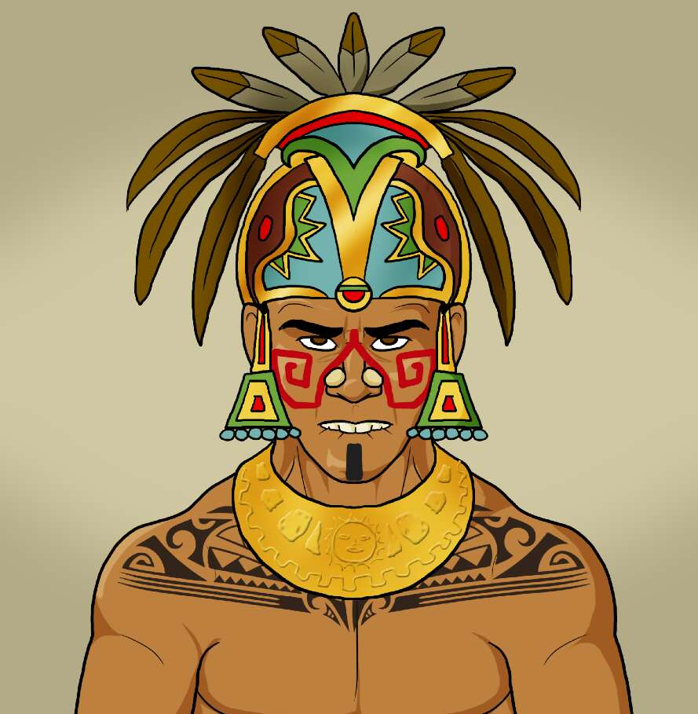

# The Civilization Of Mayan Collection

4995 个玛雅勇士的独家 NFT 集合 - 作为 ERC-721 代币存在于区块链中。 与我们一起成为新历史的一部分。

玛雅文明收藏 NFT - 常见问题（FAQ）
▶ 什么是玛雅文明收藏？
玛雅文明系列是一个 NFT（非同质代币）系列。 存储在区块链上的数字艺术品集合。
▶ 玛雅文明收藏代币有多少？
总共有 4,998 个玛雅文明收藏 NFT。 目前，28 位所有者的钱包中至少有一本 The Civilization Of Mayan Collection NTF。
▶ 《玛雅文明》系列最近卖出了多少？
过去 30 天共售出 0 个 The Civilization Of Mayan Collection NFT。

