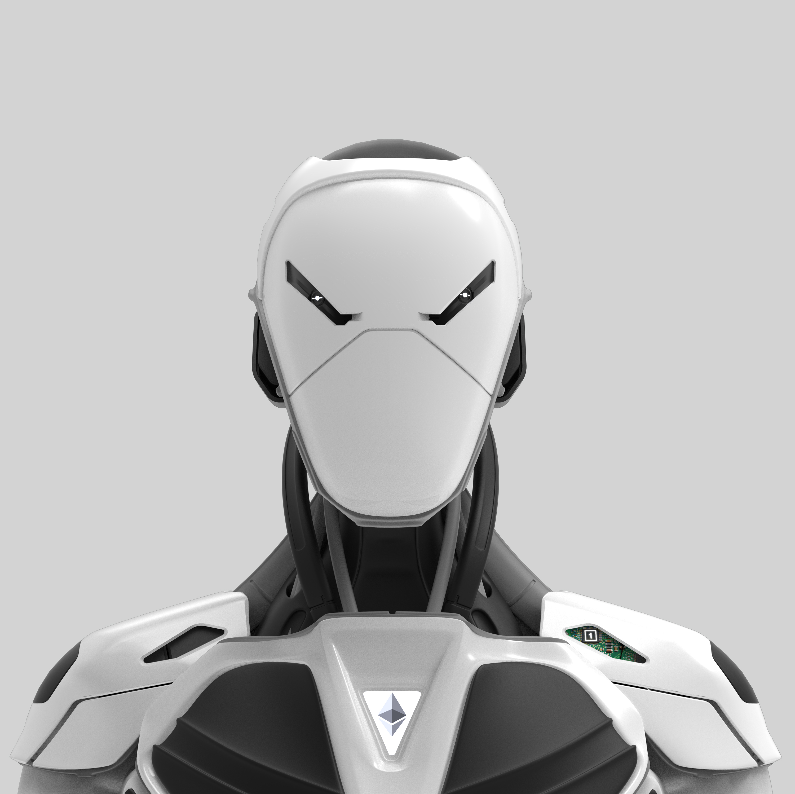

# The Metaversus Arena

**Metaversus 竞技场数据**

创建于 6 个月前，373 代币供应，7.5% 费用

过去 7 天没有售出任何 The Metaversus Arena。

Metaversus 是 8888 个 NFT 的集合，集成到 Metaversus 战斗竞技场中。这些先进的袖子可用于战斗以获得与对手的竞争优势，并可与 Opensea 上的其他玩家交易。

Metaversus Arena NFT - 常见问题（FAQ）

▶ 什么是 Metaversus 竞技场？

Metaversus Arena 是一个 NFT（非同质代币）集合。存储在区块链上的数字艺术品集合。

▶ 有多少 The Metaversus Arena 代币？

总共有 373 个 Metaversus Arena NFT。目前，212 位所有者的钱包中至少有一个 The Metaversus Arena NTF。

▶ 最近卖出了多少台 Metaversus Arena？

过去 30 天内售出 0 个 The Metaversus Arena NFT。

