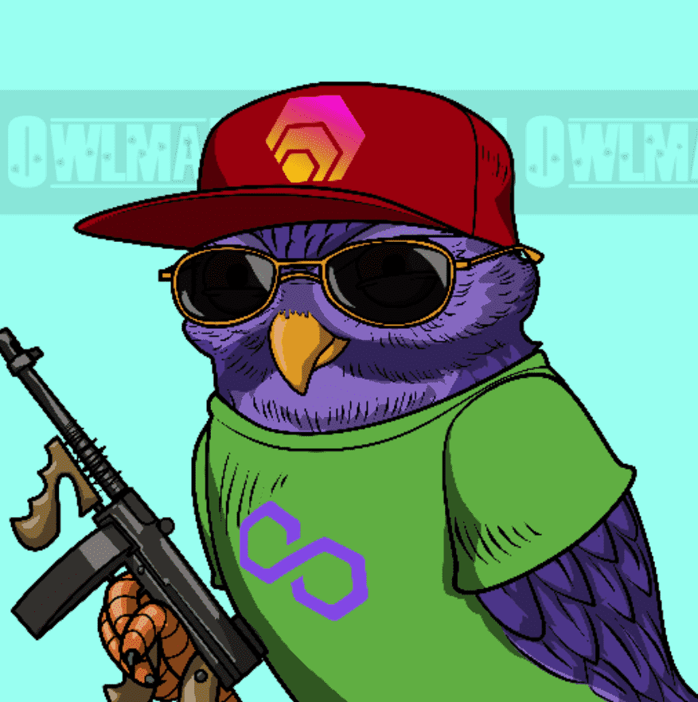

# The Owlman

猫头鹰城是一个大而复杂的地方。大黑帮统治城市，流血在黑帮战争上的时代早已一去不复返了。为了安抚这座城市，警察不得不炸毁两个挤满了暴徒的街区。在这个令人震惊的结果之后，三个帮派家庭达成了强制休战，以防止更多的暴力事件发生。三十多年过去了，从三个黑帮家族的灰烬中，新一代的黑帮恶毒地崛起，渴望权力。他们心中没有道德准则，唯一阻止他们接管城市的就是给予老家族老板的和平承诺。今晚就要改变了，因为最后一个boss刚刚去世，停战协议被打破……报应的时候到了！

