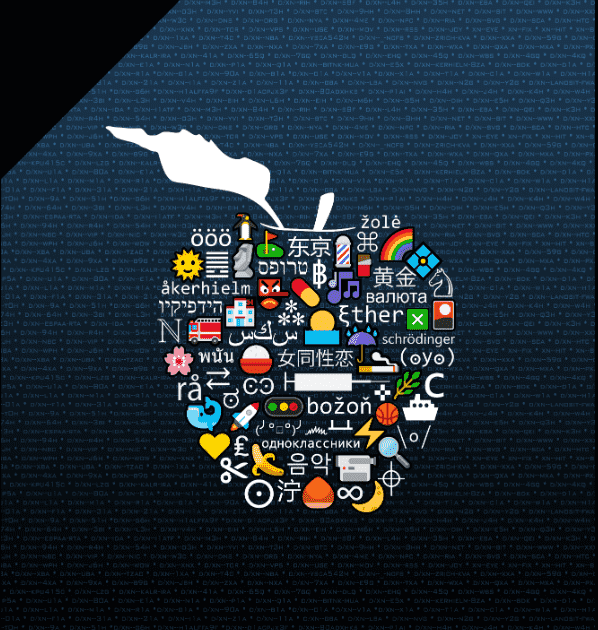

# The Puny Factory

Puny Factory 是一个不断增长的 ERC1155 系列，有两个目的：1. 在 Punycodes 和其他社区之间发布合作作品 2. 作为社区及其他艺术家的启动板

什么是 Punycode？
早在 2011 年，区块链领域的一些先驱者使用一种称为 Punycode 的编码语言将各种形式的符号、表情符号、ASCII 艺术等作为 NFT 添加到 Namecoin 区块链上。这催生了加密收藏品历史上第一个视觉 NFT：Punycodes。一些例子：

现代的顶饰艺术
70 万多年前，直立人（人类已知最早的物种）在洞穴的墙壁上创作了已知最早的艺术品，称为岩画。

洞穴墙壁的目的不是作为一种艺术媒介，但这并没有阻止早期人类在这些墙壁上表达他们的创造力。

以类似的方式，通过在区块链上实现简单数据存储的所有权，Namecoin（中本聪本人做出了贡献）无意中不仅催生了 DNS（域名系统），而且还催生了一种新的媒介来表达他们的创造力，一成不变.

人们在创作后 20 天内就开始使用这种媒介来存储艺术品！

