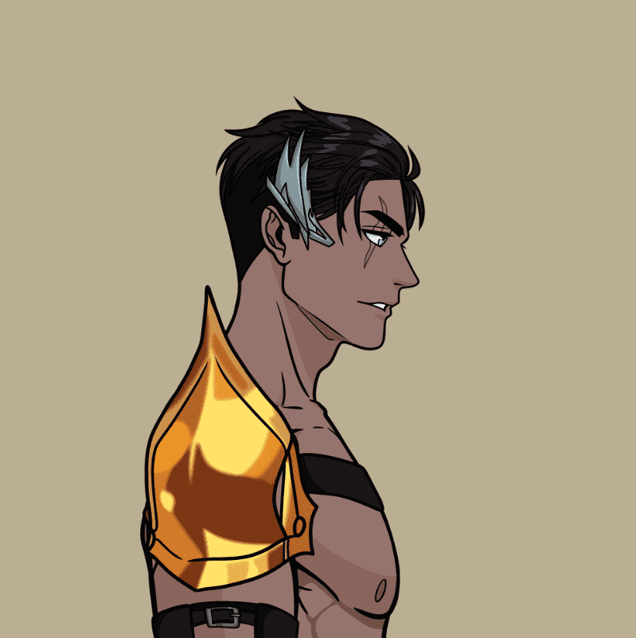

# SakuraProject

5678 个受动漫启发的 NFT。 探索 Inferen 的世界，两个交战派系竞相寻找 The Great Bloom。 他们会使用大绽放的力量来拯救人类还是控制人类？ 加入战斗，我们创建一个社区主导的分支叙事，并为 NFT 设定新标准，为持有者提供首创的、可转让的许可协议。

SakuraProject NFT - 常见问题（FAQ）
▶ 什么是樱花计划？
SakuraProject 是一个 NFT（Non-fungible token）集合。存储在区块链上的数字艺术品集合。
▶ 有多少 SakuraProject 代币？
总共有 773 个 SakuraProject NFT。目前，361 位业主的钱包中至少有一个 SakuraProject NTF。
▶ SakuraProject 最昂贵的交易是什么？
最昂贵的 SakuraProject NFT 是 Sakura Project #493。它于 2022-06-10（3 个月前）以 2.7 美元的价格售出。
▶ 最近卖出了多少 SakuraProject？
过去 30 天内共售出 1 个 SakuraProject NFT。
▶ 什么是流行的 SakuraProject 替代品？
许多拥有 SakuraProject NFT 的用户还拥有 TTAV-Time Traveling Anime Villains、 DerpDerp DerpDerp、 Wicked Craniums Comic和 Char0。

