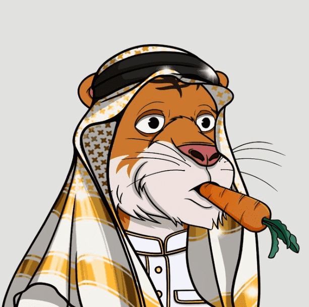

# The Saudi Tigers

使用 ERC 721A 智能合约标准构建，在单笔交易中铸造多个 NFT 时支付更少的 gas 费用 大新闻即将推出 Habibies，在售罄之前尽快铸造您的沙特老虎！！！The Saudi Tigers 系列包含上世纪最伟大的沙特领导人的 30 件独特艺术作品。这不仅仅是一门杰出的艺术。持有者将获得独特的收藏体验，独家获得版税福利以及与其中一些沙特领导人举行的聚会活动。

The Saudi Tigers NFT - 常见问题（FAQ）
▶ 什么是沙特之家？
The Saudi Tigers是一个 NFT（非同质代币）集合。存储在区块链上的数字艺术品集合。
▶ 存在多少个The Saudi Tigers代币？
总共有 29 个 The Saudi Tigers。目前 3 位业主的钱包中至少有一个 The Saudi TigersNTF。
▶ 最近卖出了多少The Saudi Tigers？
过去 30 天内售出 0 个The Saudi Tigers NFT。

