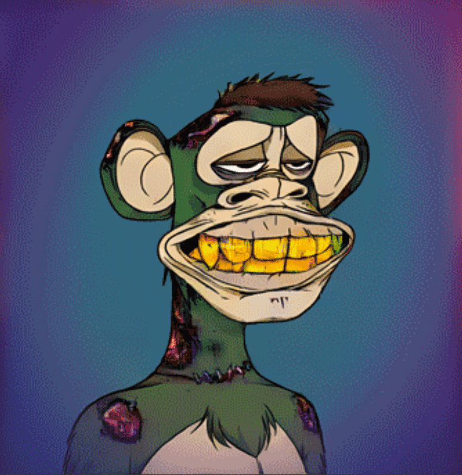

# These Apes Don't Exist

这些猿不存在是 4,444 个高分辨率（2048 x 2048 像素）人工智能生成的猿的集合，这些猿具有超色彩混合视觉特征，由在数据中心规模的 GPU 集群上训练的神经网络想象。 所有的猿都是1/1。

我们构建了一个人工智能驱动的猿设备，可以构建高分辨率（2048 × 2048px）虚构的无聊、突变和混合猿，其视觉特征只能通过在数据中心规模的 GPU 集群上训练的神经网络来想象。

生成的对抗网络(GAN)通过算法选择渲染的每个笔画和颜色。

我们的集合元数据没有为每个标记设置定义的特征，因为由神经网络驱动的渲染无缝地融合了数百万个学习的连接，并且每个视敏度点都是能够渲染的所有其他特征的 AI 混合。

所有特征都以独特的方式呈现，以全分辨率可见的精细和独特的细节。

