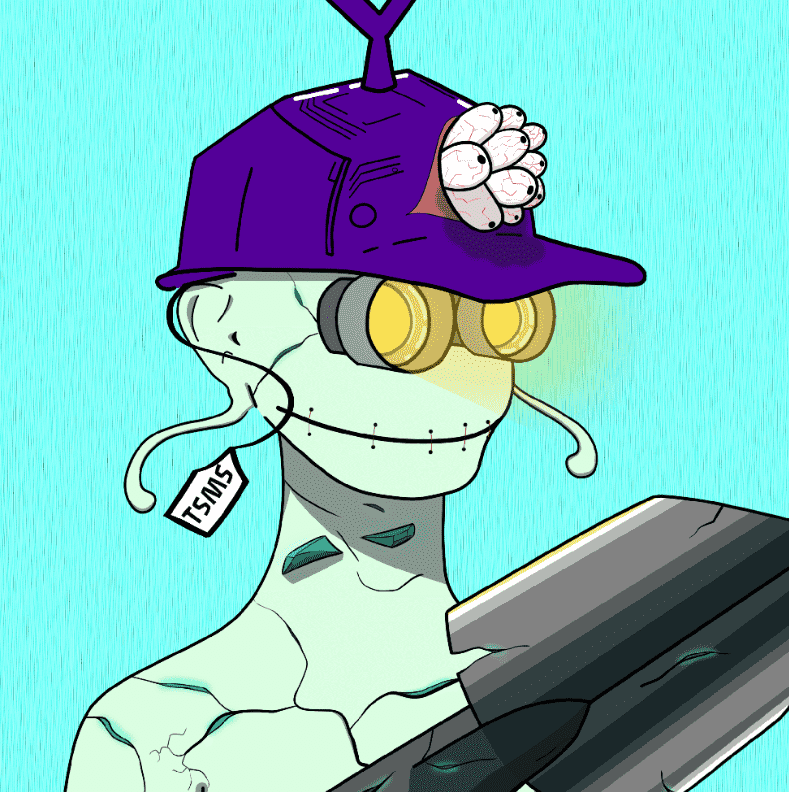

# The Sleepless Mine Society Official

欢迎来到不眠矿工协会，那里有 4,000 名不眠矿工被感染，目前生活在以太坊区块链上。 Sleepless Mine Society 是一个社区驱动的项目，旨在通过使用我们的 $SLEEP 代币来奖励其持有者各种实用程序

不眠矿山协会官方 NFT - 常见问题（FAQ）
▶ 什么是不眠矿山协会官员？
Sleepless Mine Society Official 是一个 NFT（非同质代币）集合。存储在区块链上的数字艺术品集合。
▶ 不眠矿山协会官方代币有多少？
总共有 613 个 The Sleepless Mine Society 官方 NFT。目前，320 位业主的钱包中至少有一份 The Sleepless Mine Society Official NTF。
▶ 不眠矿公会最近卖了多少？
过去 30 天共售出 0 个 The Sleepless Mine Society 官方 NFT。

