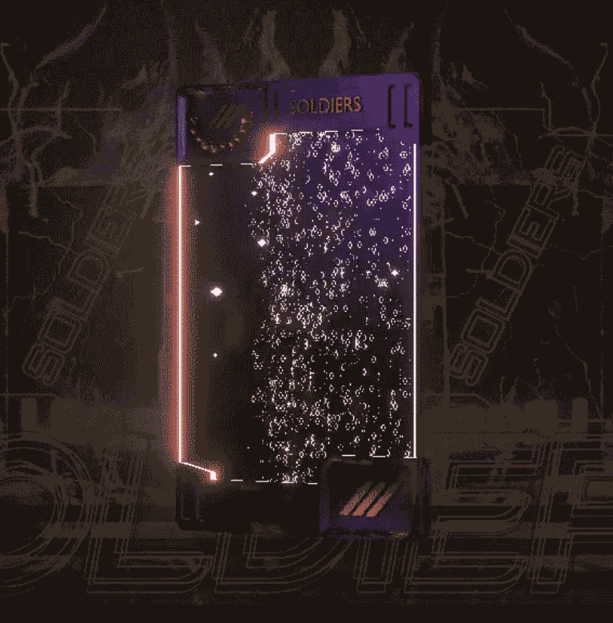

# The Soldiers Official

The Soldiers NFT 项目的象征是自由与和平。 期待士兵们以军事理念保卫每个国家。 The Soldiers 是一个将社区放在首位的项目，并且拥有一个不仅会留在社区中而且还会增加您的经济自由的过程。 The Soldiers，韩国第一个现实生活生态系统项目。

士兵们故事
22 年 4 月 18 日，NASA 承认 UFO 的存在。
通知每个国家计划入侵。

美国内华达州林肯县新郎湖。
在这个通常被称为 51 区的地区通讯成功，他们的目的是入侵。

各国元首召开紧急会议
判断无法用现代武器进行战斗，他开始开发一种新的武器机器人。

在新武器的开发过程中出现了一个有趣的测试结果。

我喜欢玩 FPS 游戏胜过我的身体能力。
士兵的战斗力要好得多。

