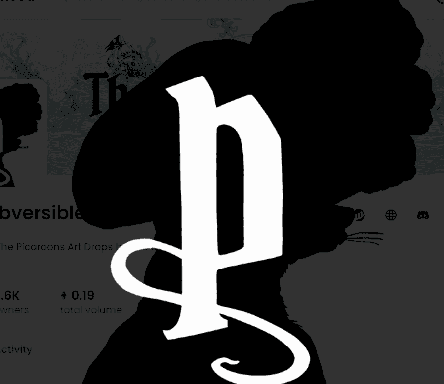

# The Subversibles

介绍 The Shipbuilders 的 Picaroons Art Drops。 SubVersibles 是 The Picaroons 的海洋生物朋友（和一些敌人）——一群杂色的流浪者在 metaver-sea 中航行以寻找宝藏、饼干和……爱。

忠于 Picaroons 旗帜的个人资料图片（twitter/discord）的竞赛和赠品。

独家商品将提供给 Picaroon 收藏家。
对于拥有 8 个以上 Picaroons 的忠实持有者，您将获得 AMA 访问 Pranksy 和出色的 Picaroon 艺术家 Alex Lucas。
您还将获得 Discord 角色“队长”。
对于 50 多个 Picaroons 的忠实持有者，您将获得崇高的称号，“海盗女王/国王”。

如果您拥有所有 8 名船员（每个物种一个），您将被空投一艘具有自己独特特征的海盗船员的 NFT 船。日期待确认。
扩展原始 Picaroons 及其 10,000 名后裔背后的传说。
在望远镜的尽头，您可以窥探 Picaroon 持有者的有趣活动，在那里您可以一起跳海盗吉格舞，以及未来几年出现的单独的实体壁画和街头艺术。

