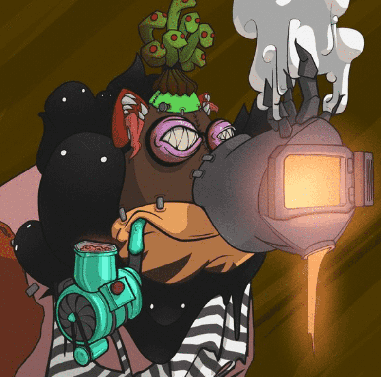

# The Symbiosis

Symbiosis 是来自 Angry Boars 项目的实验性育种模型。 最多可以铸造 3815 个共生体。The Symbiosis - Mining for The Symbiosis（我们的育种模型）将于 12 月 15 日下午 4 点 UTC 开始。有关此内容和路线图 2.0 的更多详细信息，请加入我们的 Discord。

愤怒的猫鼬
我们的第一个伴侣系列 - 愤怒的猫鼬将于 10 月 30 日下午 4 点 UTC 发布。
愤怒的猫鼬铸币将于 11 月 29 日下午 4 点 UTC 关闭！

等待我们的第一个同伴系列即将结束！您将有 30 天的时间以每 1 头公猪 1 个猫鼬的速度铸造您的猫鼬（免费铸造 + 汽油）。您可以在方便的时候铸造，当汽油不足时，一次铸造一个或多个。

