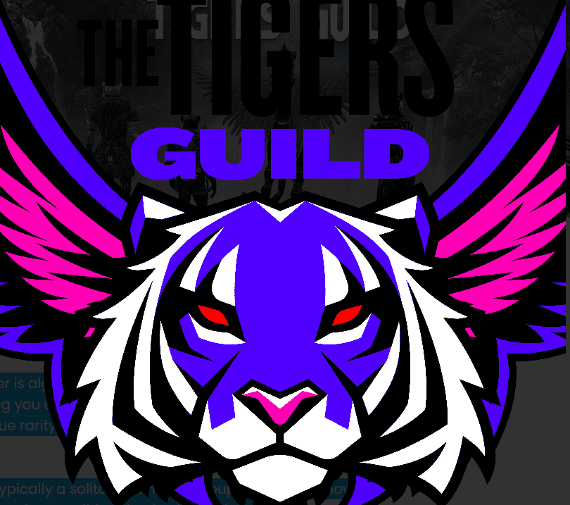

# TheTigersGuild

欢迎来到老虎公会 - 第一个完全 3D 动画老虎 NFT 接管丛林。每只高品质老虎都是使用超过 500 种属性/特征通过算法生成的，由于独特的稀有性，为您提供完全独特的老虎 3D 模型 老虎公会团队开发的算法。虽然老虎通常是独居动物，但一群老虎被称为“伏击”，老虎公会伏击将只有 8,888 名成员生活在以太坊区块链上。

TheTigersGuild NFT - 常见问题（FAQ）
▶ 什么是 TheTigersGuild？
TheTigersGuild 是一个 NFT（不可替代令牌）集合。存储在区块链上的数字艺术品集合。
▶ 有多少 TheTigersGuild 代币？
总共有 2,675 个 TheTigersGuild NFT。目前，884 位所有者的钱包中至少有一个 TheTigersGuild NTF。
▶ 最近售出了多少 TheTigersGuild？
过去 30 天内售出了 0 个 TheTigersGuild NFT。

