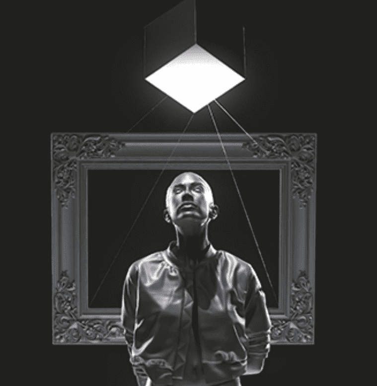

# The Token Beyond The Image

一个不断变化的、充满活力的艺术作品。 每 24 小时，它利用智能合约在链上转换视觉和描述，X 随时间变化。 每个视觉都迫使我们质疑代币化艺术的内在价值在哪里。过去 7 天没有售出 The Token Beyond The Image

The Token Beyond The Image NFT - 常见问题（FAQ）
▶ 什么是超越图像的代币？
The Token Beyond The Image 是一个 NFT（Non-fungible token）集合。存储在区块链上的数字艺术品集合。
▶ The Token Beyond The Image 代币有多少？
总共有 1 个 The Token Beyond The Image NFT。目前，111 位所有者的钱包中至少有一个 The Token Beyond The Image NTF。
▶ The Token Beyond The Image 销售中最贵的是什么？
The Token Beyond The Image NFT 售出的最贵的是 The Token。它于 2022 年 6 月 16 日（3 个月前）以 190 美元的价格售出。
▶ The Token Beyond The Image 最近卖出了多少？
过去 30 天内售出了 1 个 The Token Beyond The Image NFT。

