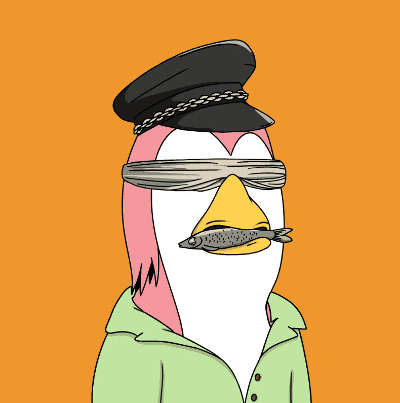

# TheWaddles

准备好#WaddleToTheMoon 了吗？！ 每人免费薄荷 1 个！ .004ea 如果您想要更多（最多 5 个）:) 团队将保留 150 个 Waddles 用于促销/赠品！ 关注我们的 Twitter 以加入赠品并随时了解最新信息！ https://twitter.com/TheWaddlesNFT 你得到金蛋了吗？

TheWaddles NFT - 常见问题（FAQ）
▶ 什么是TheWaddles NFT？
TheWaddles 是一个 NFT（不可替代令牌）集合。存储在区块链上的数字艺术品集合。
▶ TheWaddles 代币有多少？
总共有 1,044 个TheWaddles NFT。目前，605 位所有者的钱包中至少有一个TheWaddles  NTF。
▶ TheWaddles NFT 销售中最昂贵的是什么？
最昂贵的 TheWaddlesNFT 是 Baddie #8154。它于 2022-08-23（8 天前）以 11.3 美元的价格售出。
▶ 最近卖出了多少 TheWaddles？
过去 30 天内售出了 4 个 TheWaddles NFT。

