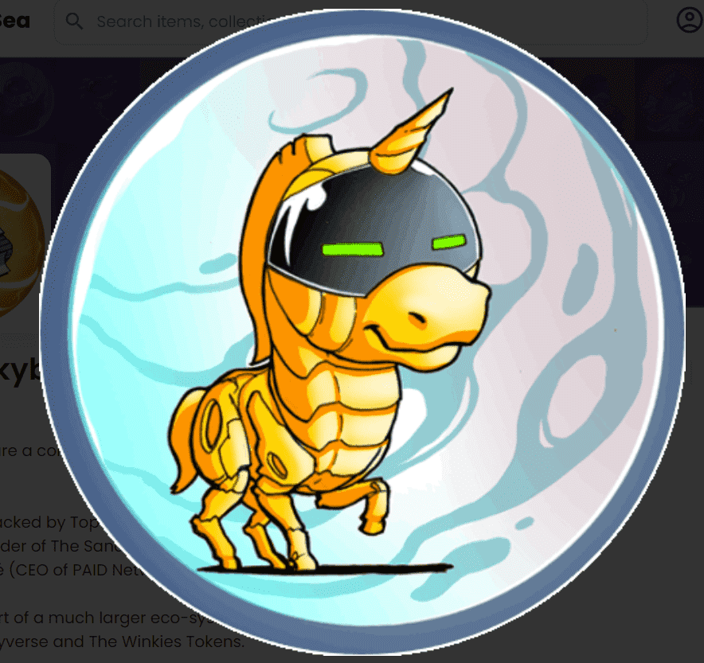

# The Winkybots

Winkybots 是 12,111 个 NFT 的集合，带有多种实用程序和奖励。我们的项目得到了顶级顾问和投资者的支持，例如：Sébastien Borget（The Sandbox 的联合创始人）、Nicolas Gilot（Ultra 的联合创始人）和 Kyle Chassé（PAID Network 和 Master Ventures 的首席执行官）。NFT 是一个更大的生态系统的一部分，其中包括：Winky Robot、The Winkyverse 和 The Winkies Tokens。Winkyverse 是第一个全球教育游戏 Metaverse，玩家可以在其中创建和货币化 使用 Winkies 代币进行他们自己的教育游戏和创作。Winkies 代币是 The Winkyverse 中唯一的价值货币。 这是一个具有许多不同实用程序的 ERC-20 代币。 Winkies 代币的 ICO 将于 2021 年 10 月 25 日开始。

