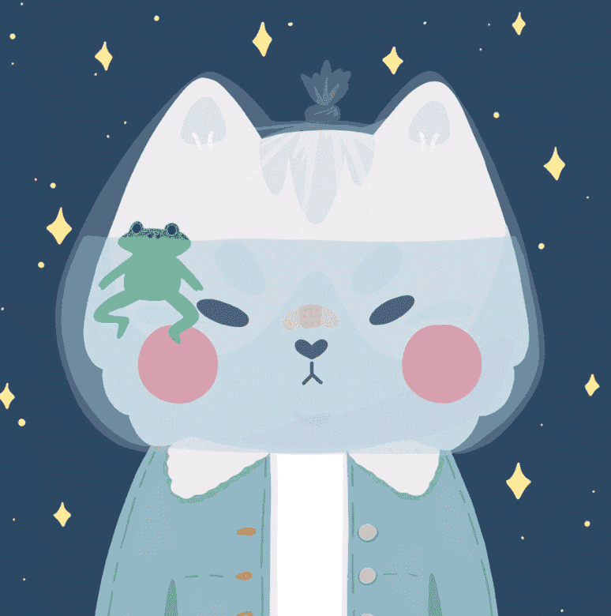

# The Wolfies - Chapter I

The Wolfies 是由艺术家创立的 5,000 只可爱的狼的集合，它们生活在以太坊区块链上。

Wolfies 通过 genesis 集合登陆 Web3。 每个 Genesis wolfie 都是根据社区提出的想法或直接来自艺术家的想法精心手绘而成的。

大家GM！ 我是 The Wolfies 背后的艺术家和创始人 Mailyn。 在另一种生活中，我在一家大型科技公司从事商业智能和产品思维工作，但我想要的不仅仅是 PowerPoint 幻灯片来表达我的创造力。 然后我偶然发现了 Web3，发现了一个无限可能的世界。 但最重要的是，我可以以我以前从未想过的方式探索这种创造力。

