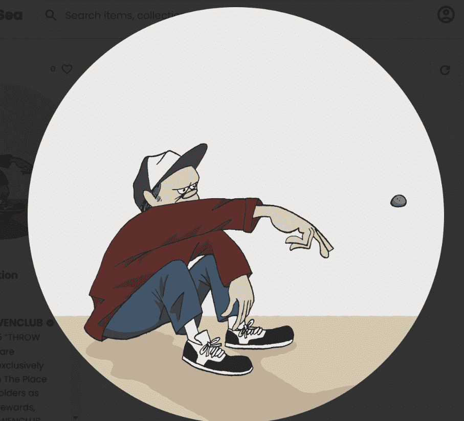

# THROW STONE by Yusuke Hanai

共有 1125 个“THROW STONE”NFT 作为社区奖励，由 FWENCLUB 创建，专为“他们所爱的地方的人”持有者空投。 这款特殊的数字艺术作品拥有 4 种设计的 250 个版本，可用于装饰您的空间，作为 METAVERSE 中的精美细节装饰品。 125件特别版将保留给木板抽奖获奖者。 该艺术的灵感来自于花井雄介的一件著名雕塑，他想通过这件作品为那些在艰难时期奋战的人们鼓掌。

关于这个项目独特的优质 NFTS独特的属性传奇艺术品
Yusuke Hanai 即将来到虚拟世界！
在“他们所爱的地方的人”系列中，头像数量有限，数量为 1,000 个。每个单独的头像都经过特殊设计，穿着独特的手绘属性，并被视为高品质的艺术品。这是Yusuke Hanai 的 NFT 项目的 3 个阶段中的第一个，目标是总共铸造 3,000 个 NFT。这位日本当代艺术家一直在设计一个系列，以反映他 20 多岁的生活经历。它的灵感来自一个现已不复存在的酒吧，艺术家曾经在那里工作以及他在那里度过的美好时光。

