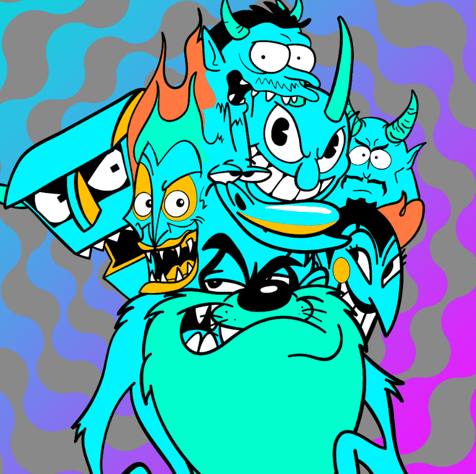

# Thumbs Self Loathing Genesis Collection

来自伦敦出生的艺术家的 genesis NFT 系列； 大拇指。 Thumbs 是一位国际代表艺术家，以这种流行文化风格的艺术品而闻名收藏大小：1235 实用程序包括：免费访问 B/ART 10k 版本 此系列中的 10 x 超稀有 NFT 随附 Thumbs 的 1/1 定制佣金和匹配的 1/ 1 NFT 100 人铸造 2 个 NFT 将从该系列中随机获得下一个 HipHop X 漫画 NFT 下降的白名单 50 位随机收藏家将收到独家 Wave 1 签名和编号的实体印刷品（运费由持有人支付。此印刷品还将 NFT 持有者可在 Thumbs Club 商店以有限颜色购买）通过 NFT 持有者 Discord 频道和 Thumbs Club 商店获得 NFT 持有者专属商品 自动参与 NFT 抽奖（多个 Thumbs NFT 视为多次参与） 抢先获得 Thumbs 网站上的商品掉落和折扣 抢先体验 Thumbs 自我厌恶怪异科学乙烯基玩具

