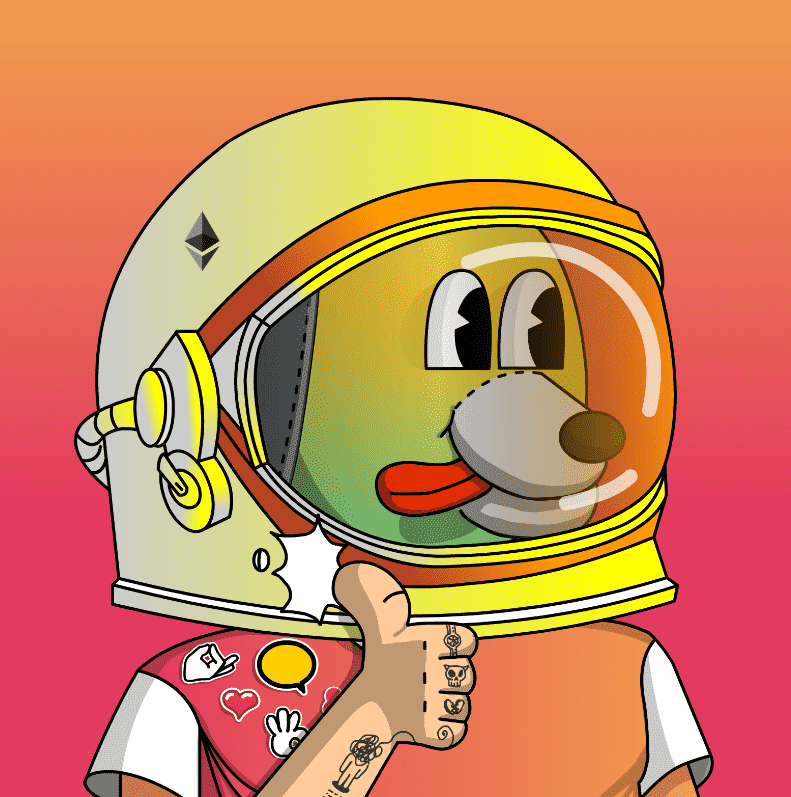

# Thumbs Up Guys

一个 NFT 项目为收集竖起大拇指而生！ 活力。 现在就与竖起大拇指的人一起冒险吧。

竖起大拇指！伙计们为了世界和平与星际秩序：大拇指之旅！行星

最初基于竖起大拇指！在 M77 星系的行星上，由 7 个竖起大拇指的人组成的 777 Galactic Guard 正在将黑暗星云怪物——他们唯一的兴趣是在整个宇宙中造成混乱和混乱——转移到星际监狱，当时他们的宇宙飞船发生故障并坠毁在地球上。撞击的冲击让黑暗星云怪物逃了出来，大拇指也散了！能源，它是全球范围内竖起大拇指的人的动力来源。

 黑暗星云怪物开始利用他们的大拇指向下能量的破坏力在地球上造成严重破坏，使世界陷入彻底的混乱之中。为了拯救世界，OpenSea 联合部队司令部求助于唯一能够阻止这些怪物的实体——777 Galactic Guard 的伙计们竖起大拇指。

 竖起大拇指的家伙现在必须停止对地球的破坏！

如何？他们通过与人的竖起大拇指互动获得能量！

当他们收集到 7777 个竖起大拇指时，他们可以放大竖起大拇指！能量进入巨大的彩虹竖起大拇指！射线。

 现在冒险开始击败黑暗星云怪物并返回他们在 M77 星系中的母星！

为了世界和平和星际秩序！

