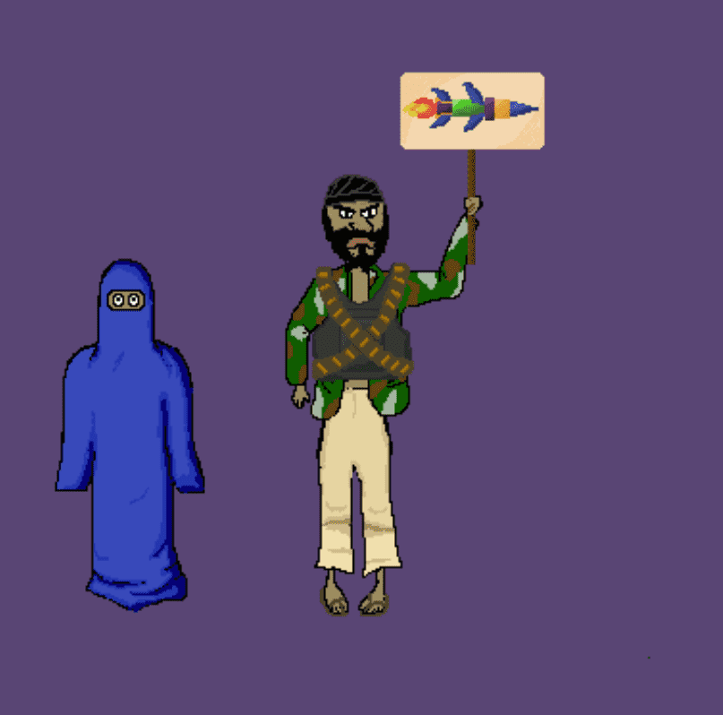

# Ticked off Taliban

勾选的塔利班 NFT 是 1270 名愤怒的塔利班的集合，准备在未来的战场上战斗……区块链。 每件物品都是手绘的，拥有超过 80 种个人特征，这些特征结合起来创造出具有特殊个性的独特角色。 购买、交易、出售这些由 SOFskulls 团队打造的独特角色。 一旦我们达到 500 位所有者，NFT 的所有权可以让您直接访问我们与特种部队社区成员的不和谐，在那里您可以直接向绿色贝雷帽、海豹突击队、游骑兵队提问。SOF Skulls 是一个供特种作战士兵与平民建立联系并通过 NFT 销售为 SOF 创业公司筹集资金的社区。

