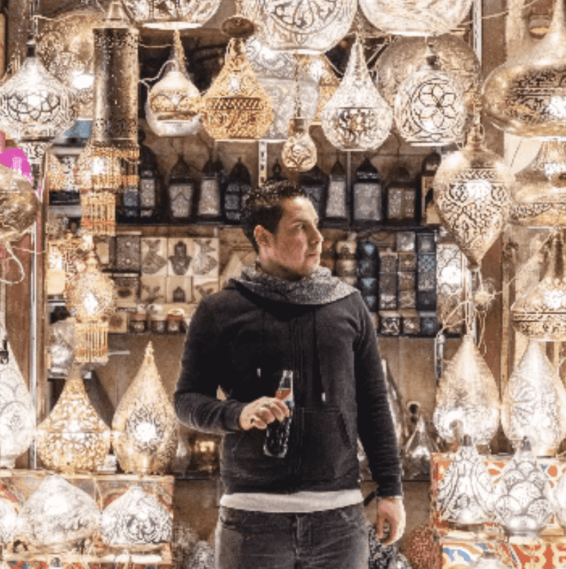

# Ticket To The World

这个限量版胶囊系列讲述了世界各地六个标志性地方的故事，这些地方在我的旅行摄影师的道路上留下了印记。作为一名旅行记者，我现在在世界各地旅行，讲述故事。 但我的旅程始于纽约的街头、摩洛哥的沙丘、伊斯坦布尔的渡轮上。这些是他们的故事，通过六个胶囊，以六幅图像捕捉每个地方的精神。 与我一起前往芝加哥、伊斯坦布尔、纽约、摩洛哥、埃及和阿曼，了解这些地方并观看我的摄影师的旅程展开。这个由六张六张 6/6 图像组成的六张胶囊系列是在整个期间在六个目的地拍摄的 六年。 将一次发布 6 张图片，下一个胶囊 6 张将在售罄时发布。 最终系列将包含 36 张图片。关于：Yulia Denisyuk 是一位屡获殊荣的旅行摄影师，从事世界各地的工作。

