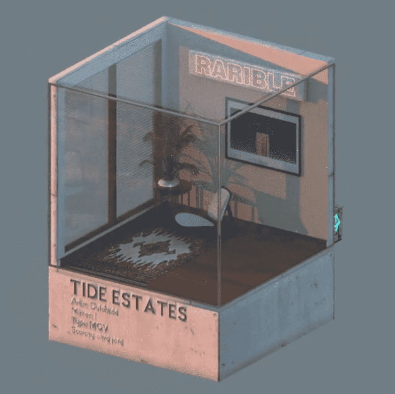

# Tide Estates

该系列包含 Tide Estates 的多个版本。 从常见到极其罕见。过去 7 天内没有出售任何 Tide Estates。

Tide Estates NFT - 常见问题（FAQ）
▶ 什么是潮汐庄园？
Tide Estates 是一个 NFT（不可替代代币）集合。存储在区块链上的数字艺术品集合。
▶ 有多少 Tide Estates 代币？
总共有 5 个 Tide Estates NFT。目前，182 位业主的钱包中至少有一个 Tide Estates NTF。
▶ 最昂贵的 Tide Estates 拍卖会是什么？
最贵的 Tide Estates NFT 是 月へ戻って。它于 2022-08-05（27 天前）以 281.4 美元的价格售出。
▶ 最近卖出了多少个潮屋？
过去 30 天内售出了 4 个 Tide Estates NFT。
▶ 流行的 Tide Estates 替代品有哪些？
许多拥有 Tide Estates NFT 的用户还拥有 Hanzo Founders Collection、 Hazai 's Editions、 flymeta和 Kalis 的 Imperfects。

