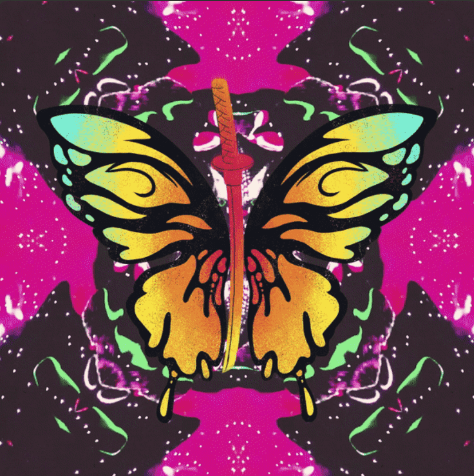

# Tie Dye Ninja Party Favors

现在有 7,777 名扎染忍者居住在道场花园中。 忍者将成为那些特殊/庆祝场合的空投派对礼物。 穿越月球，进入宇宙。

欢迎大家加入 Tie Dye Ninja Collective。 🥷🦋🪐

Tie Dye Ninjas 是以太坊区块链上 7,777 个独特 NFT 的集合。

扎染忍者的存在是为了保持高涨的氛围并培养所有种族和物种的集体意识。您的 Tie Dye Ninja 不仅仅是一个化身；它是尊重、包容、创造力和言论自由的象征。铸造您的扎染忍者后，您将正式进入道场花园并正式成为和平战士。

TDN 是所有负责任的迷幻探索者、以精神为中心的生物和心理健康倡导者的宇宙 NFT 之家。 TDN 社区旨在激发和鼓励对创造力的探索和对新想法的接受。玩的实践是TDN起源的症结所在。

所有扎染忍者都是 0.07 ETH。没有粘合曲线或 FOMO 定价。包容、团结、平等、尊重和社区支持是 Tie Die Ninja 集体的精神。

Tie Dye Ninjas 持有者将参与共同创作 TDN 正在进行的艺术项目。策划 meta-verse 和 IRL 活动、服装和 meta-verse 可穿戴设备、集体会员空投等等。 TDN 旨在参与并鼓励围绕意识以及与我们所生活的世界不断发展的关系进行真正的对话。同时始终保持健康剂量的绝对荒谬的乐趣。

