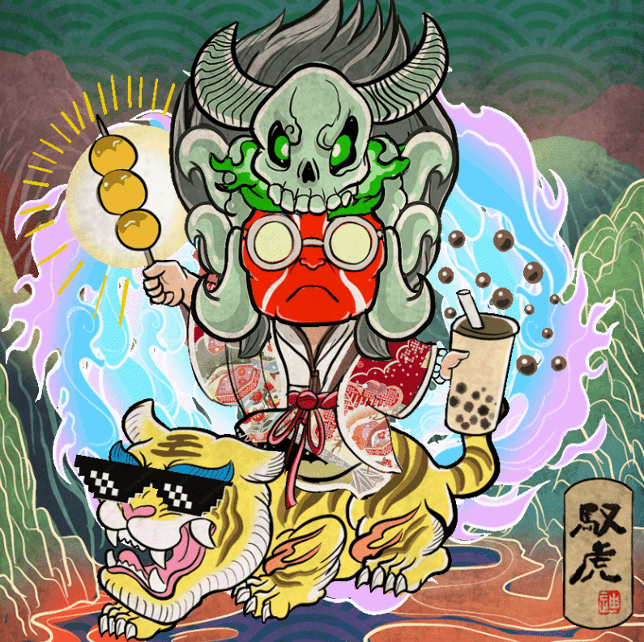

# Tikka Tiger NFT

Tik Ka Tiger NFT 是由香港艺术家“来自东方的 Tik ka”(Tik Ka) 创作的。 他将港式武侠、粤语等个人喜爱的元素，融入了这种文化的精神。 他希望所有的收藏家和粉丝都能进入“老虎宇宙”。

融合中式画风与现代艺术Tik ka from East 系列的著名艺术家Tik Ka，宣布与团队推出Tik Ka Tiger NFT 。 

Tik Ka Tiger 是源⾃ Tik Ka 的画作，创作灵感来⾃香港习俗「打⼩⼈」，中华⽂化中以「骑虎难下」形容环境恶劣，但同时「驭虎」也有驾驭解决困难之意。 

艺术家Tik Ka 希望透过Tik Ka Tiger 带出「骑虎」还是「驭虎」、被动还是主动，全取决于⼼态。克服关⼝，不单可驾驭本来的困难令⾃⼰升级，更继⽽把问题（⼩⼈）KO，希望借着项⽬⿎励所有逆境中骑虎中的⼈。

「Tik Ka Tiger」过去亦亮相于潮流艺术品及时装界别中，现在正式将「Tik Ka Tiger」的理念及宇宙观扩展⾄元宇宙。 

Tik Ka Tiger NFT 项⽬，以象征香港的数字(852)，每个NFT作品都以852 x 852 pixel 尺⼨，并将他⼩时候拥有的⽇式赠品贴纸回忆、⽇式动画风格、武侠元素等，全由Tik Ka 创作及亲⼿绘制，加入了多个象征香港⽂化的细节，部分配件亦以广东话拼⾳，以虎婆婆、老虎为组合，结合成每个独⼀无⼆的NFT。

