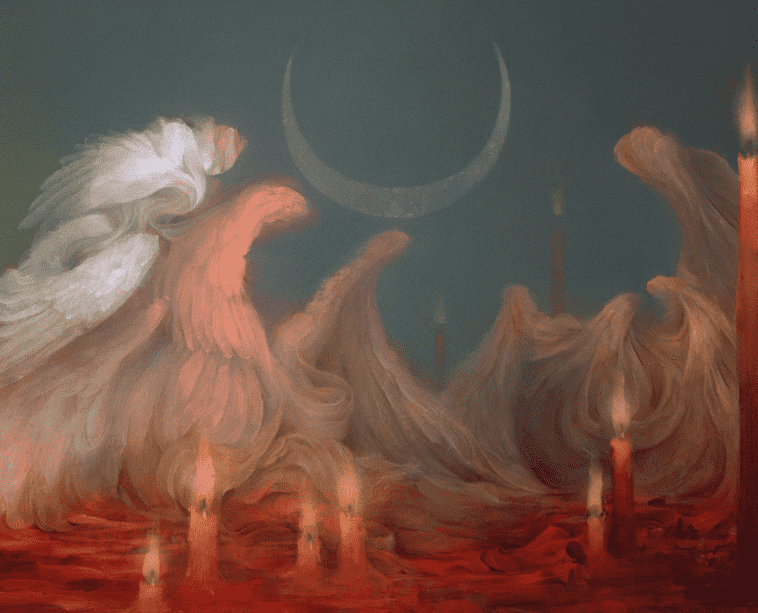

# //CWS. x Jenni Pasanen

Time Eclipse它只向前跑，从不回头。 今天是明天的昨天。 时间总是让我着迷； 这是一个充满无限理论和可能性的兔子洞。 它创造了我们的过去和未来。 我们不知道未来是否已经写在星星上，或者我们是否走在十字路口的道路上，每一个决定都会创造我们的明天。每一件作品都是以不同形式代表时间； 24 小时分为 60 天。作品的名称和结果取决于铸造的顺序。 每一个创作都是独一无二的，一个停止的时刻。昨天、今天和明天的时间会黯然失色吗？ 没有//CWS。x Jenni Pasanen 在过去 7 天内售出。

