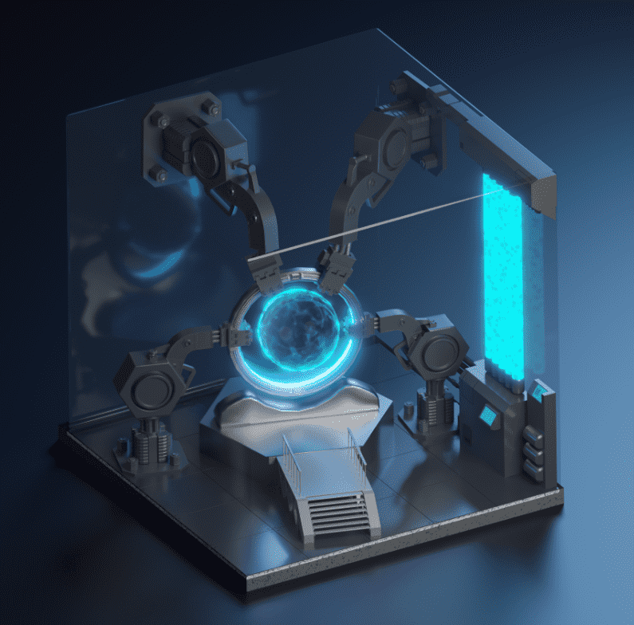

# Time Machines by Project Dark Eye

1422 Time Machines，DEYE-Universe 的终极多合一通行证持有 Time Machine 的好处：在所有后续 Project Dark Eye 发布（包括指挥官系列）中，所有机器持有者都将获得至少一个 NFT 的保证铸币点。 持有者每 24 小时将获得 DEYE 代币奖励。独家空投、赠品和活动。Project Dark Eye 正在构建一个具有游戏化沉浸式社交体验的科幻/太空/宇宙主题世界。 该项目正在推出一些代表这个世界上各种实体的 NFT 集合，以及用于其市场交易的实用代币。 艺术采用 3D 风格，实用程序包括持有以赚取和持有以增长。 核心团队成员是前 G指挥官是 6666 个 3D 化身的集合，具有超过 200 个视觉特征，其中每个化身代表 DEYE-Universe 中的指挥官角色。每个指挥官都会经历不同的事件，向不同的方向成长，并以独特的方式改变 DEYE-Universe。

铸币结束后，每个指挥官铸币者都可以命名他们的指挥官。指挥官拥有者可以稍后获得他们的指挥官许可（请参阅常见问题以了解许可说明）。

指挥官还配备了燃烧机制，可保护收藏品免受脚蹼（有关详细信息，请参阅常见问题解答）。ogle 开发人员和前 RTFKT 艺术家。

