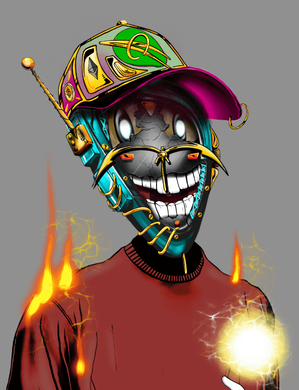

# Time Out By Acide

Time Out 从收集 777 件物品开始，让您直接从数字艺术实验室（第一个艺术家孵化器）获得会员资格和被动收入，围绕 NFT 和 Metaverse 宇宙揭示和培养新人才。 如果你能读到这里，你还为时过早！

 酸艺术

Acide 是一位法国艺术家，他决定推出自己的 Nft 收藏，这件名为

“超时”，包括 777 Nft。

通过这个系列，他计划创建第一所加密艺术学校和一个孵化器标签，以在数字艺术世界中培养年轻的人才和艺术家。

之后，将在元界设立一个画廊，展示学生和艺术家的各种作品。

Acide 和他的团队正在提供实现这一目标的方法，就像他创建自己的系列一样。

我邀请您通过单击下面的按钮查阅详细信息。

