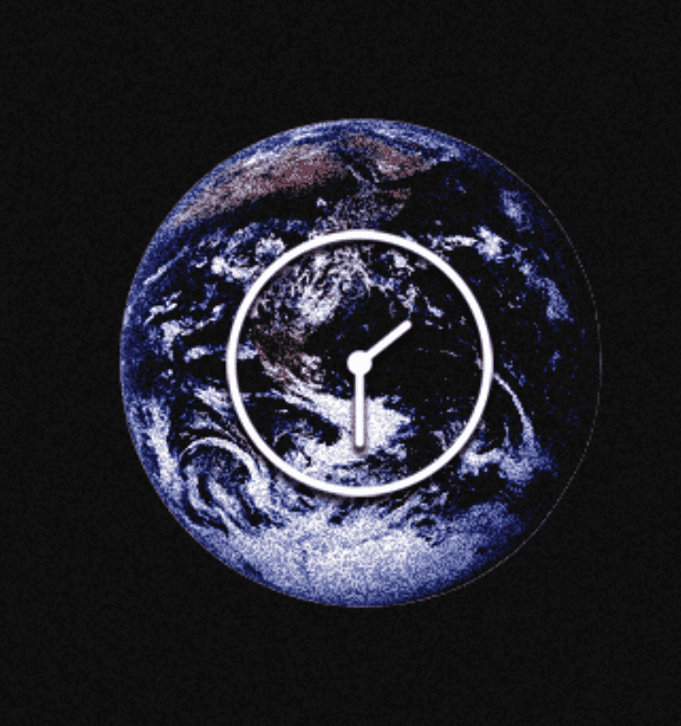

# TIME | Collection

“TIME”系列是一组在白天共享特殊时间的作品。 当这个时间到来时，NFT 切换到“特殊”图像，以及白天图像和夜间图像。 没有时间 | 收藏在过去 7 天内售出。

时间 | 收藏 NFT - 常见问题（FAQ）
▶ 什么是时间 | 收藏？
时间 | Collection 是一个 NFT (Non-fungible token) 集合。存储在区块链上的数字艺术品集合。
▶ 多少次 | 收藏代币存在吗？
总共有3次| 收集 NFT。目前 37 位业主拥有至少 1 个 TIME | 在他们的钱包里收集 NTF。
▶ 多少次 | 收藏品最近卖了？
有 0 次 | 收集过去 30 天内售出的 NFT。

