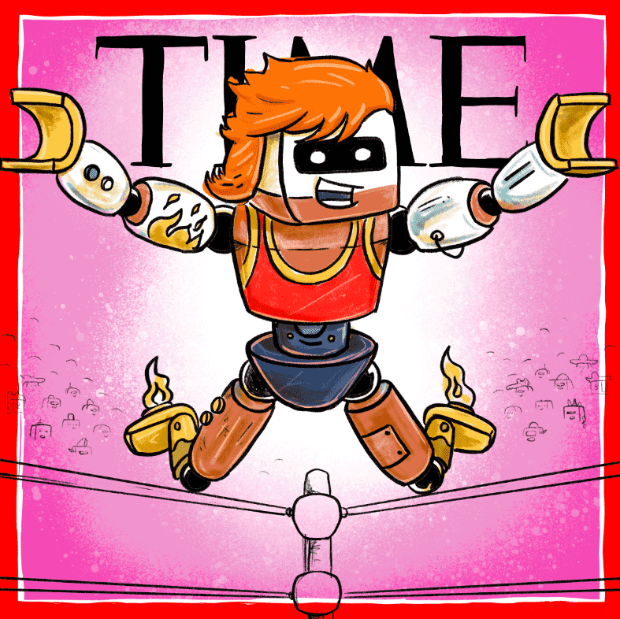

# TIMEPieces x Robotos

TIMEPieces 于 2021 年 9 月推出，是我们品牌向 web3 的演变。该系列基于 TIME 的年度人物，包括 10 件独特作品的版本，其中包含 5 幅 Pablo Stanley 对“年度机器人”的诠释。 该系列是对 TIMEPieces 和 Robotos 持有人的空投，以纪念 TIME Studios 宣布开发基于 Pablo Stanley 的 Robotos NFT 系列的原创儿童系列。 了解更多：https://time.com/6123080/time-studios-tap-nft-space-for-animated-franchises/

TIMEPieces 是 TIME 的一项 Web3 社区计划。Genesis Collection 于 2021 年 9 月推出，旨在*打造更美好的未来*。它包括来自多个学科的 40 多位令人难以置信的全球艺术家的作品。TIMEPieces 紧随其后的是驻地艺术家 Nyla Hayes 的第二个系列，名为 Long Neckie Women of the Year。 

TIMEPieces 代表了 TIME 的 Web3 社区战略的重要第一步，使我们能够以协作的方式将艺术家、收藏家和粉丝聚集在一起，以建立长期的实用性和社区价值。

