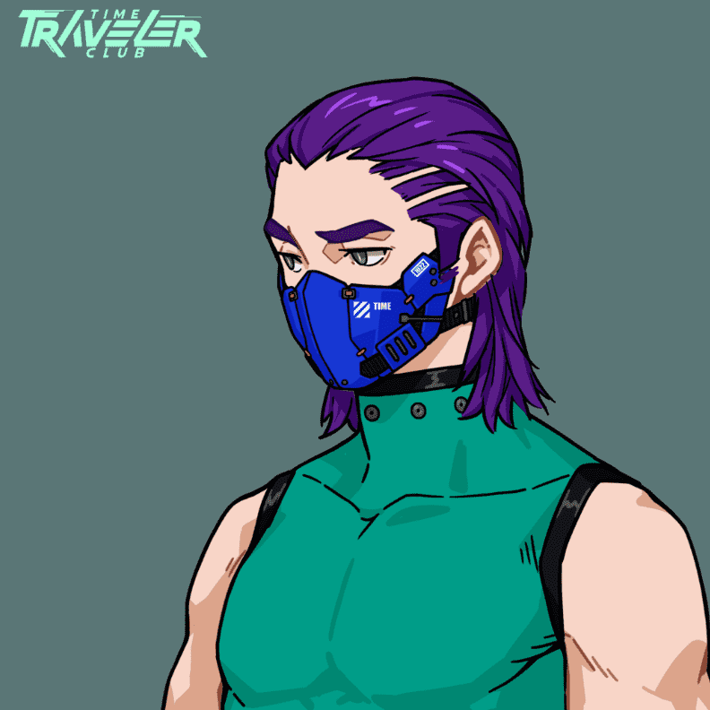

# TimeTravelerClub

时间旅行者俱乐部（TTC）是在TTC平台上使用的头像型PFP。 TTC用户可以培养自己的头像，选择自己喜欢的游戏风格，在TTC独特的世界观中与众多好友一较高下，通过游戏赚钱。 官网：https://www.timetravelerclub.com/ 游戏平台网址：https://www.timetravelerclub.com/game

事实上，往往是它自己打败了一个强大的政权。

乌沙斯联邦，当今世界上最强大的政权。然而，这个政府被联邦安全局、联邦情报局、军事调查局和乌沙斯缉毒局控制，世界分崩离析，暗流涌动。他们暗中操纵乌苏斯联邦政府，宣称“利益大于自由”，最终导致乌苏斯联邦分裂。

这个即将瓦解的超级联邦陷入了亚该亚美洲所谓的“反毒品和恐怖主义战争”。战争的本质是掠夺当地的稀土资源，但他们没有告知公众使用基因程序化植物病毒，这使得当地无法继续种植罂粟和古柯树，从而离开了全球无货可卖的毒枭。此举引起了对秘密资助毒枭的 Ushas-Alliance 大型公司的不满。旷日持久的冲突在乌苏斯联盟的高层爆发。最终，六个月后，一名不知名的毒贩在乌沙斯最大城市的中心引爆了一枚手持核弹。

次年，四组被揭露利用全球金融市场洗钱通过非法武器交易获得的资金，导致全球经济崩溃。接下来的 5 年，随着经济衰退导致战争不断，再加上流行病和自然灾害，包括一场 11 级地震淹没了西海岸 45% 的地区，都让这个世界上最强大的联邦陷入了一片废墟。四分之一的人口无家可归，大多数城市空无一人。一群由来自世界各地的极客组成的对手应运而生。他们是【时光旅行者俱乐部】。随着宪法的废除，全国进入戒严状态，原联邦成员纷纷宣布独立。

