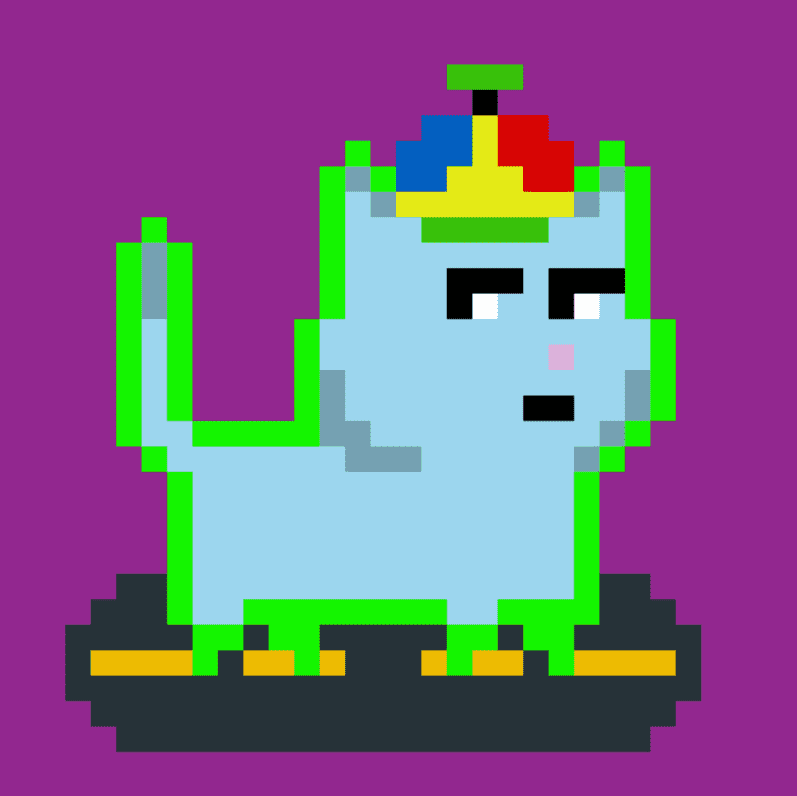

# tiny cats (poly)

cc0 全链 nft 在 7 个不同的链上铸造，并且可以在每个链之间转移 过去 7 天内没有出售任何小型猫科动物（保利）。

小猫 (poly) NFT - 常见问题 (FAQ)
▶ 什么是小猫（poly）？
tiny cat (poly) 是一个 NFT（非同质代币）集合。存储在区块链上的数字艺术品集合。
▶ 有多少只小猫（poly）代币？
总共有 513 个小猫（聚）NFT。目前，151 位业主的钱包中至少有一只小猫（聚）NTF。
▶ 最近卖出了多少只小猫（poly）？
过去 30 天内售出 0 个小猫 (poly) NFT。
▶ 什么是流行的小猫（聚）替代品？
许多拥有小猫 (poly) NFT 的用户还拥有 Omni Robotics (Polygon)、 PillowCats (Poly)、 Omni Dragons (polygon)和 Omni Mosquitoes

